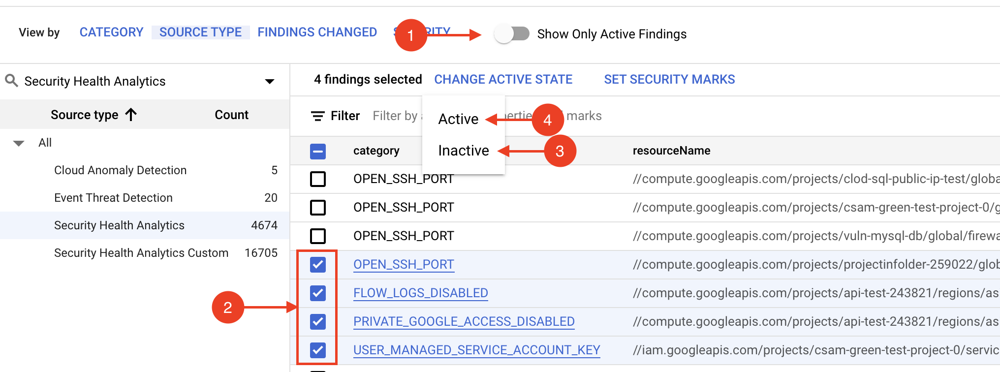
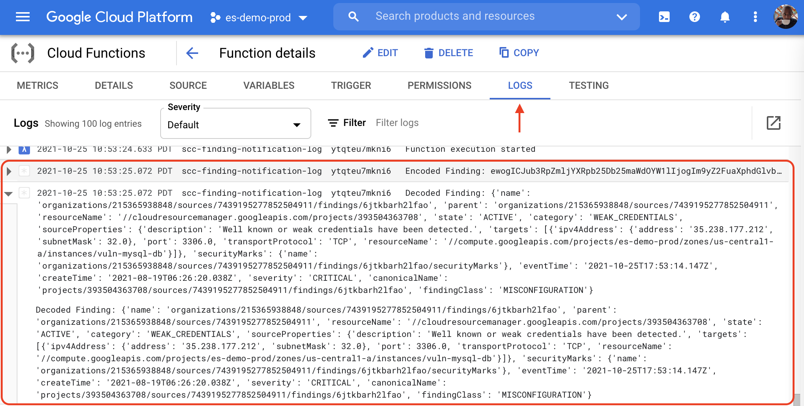

# Log Findings on SCC Finding Notification

## Step-by-Step

### Open a Terminal

The rest of this tutorial will be performed in a terminal.

1. Open a [Cloud Shell Console](https://ssh.cloud.google.com/cloudshell/editor), or a shell with the [gcloud CLI](https://cloud.google.com/sdk/gcloud) installed.

1. Clone this repository locally and make it the current working folder.

   ```shell
   git clone https://github.com/shadanan/gcp-scc-finding-notification-log.git
   cd gcp-scc-finding-notification-log
   ```

1. In the shell that we prepared at the beginning, set the org and project ID. The selected project is where the Cloud Function will execute form.

   ```shell
   export ORG_ID=<your org id>
   export PROJECT_ID=<your project id>
   gcloud config set project $PROJECT_ID
   ```

### Configure the Pub/Sub Topic and Subscription

Cloud Pub/Sub is a real-time messaging service that enables messages to be sent and received between independent applications. A publisher creates a message and publishes it to a feed of messages called a topic. A subscriber receives these messages by way of a subscription. In our case, we'll have a Cloud Function that sends an email when High and Critical severity notifications are published to the topic.

1. Create the topic where all the findings will be published.

   ```shell
   gcloud pubsub topics create scc-findings-topic
   export TOPIC=projects/$PROJECT_ID/topics/scc-findings-topic
   ```

1. Configure SCC to publish notifications to our topic.

   ```shell
   gcloud scc notifications create scc-findings-notify \
     --organization $ORG_ID --pubsub-topic $TOPIC
   ```

### Publish the Cloud Function

1. Deploy the `scc-finding-notification-log` cloud function. If you have not enabled Cloud Build API, then this command may fail. Follow the link in the error message to enable it and then try again.

   ```shell
   gcloud functions deploy scc-finding-notification-log \
     --entry-point=process_notification \
     --source=cf --trigger-topic=scc-findings-topic --runtime=python39
   ```

### Test It Out

1. In Security Command Center, manually deactivate and reactivate a high severity finding in order to trigger the cloud function. Ensure **_Show Only Active Findings_** is off so that the findings don't disappear after you deactivate one.

   

1. Check the logs for the cloud function. There should be two log entries per notification. One displaying the base64 encoded payload, and the second displaying the decoded finding.

   
